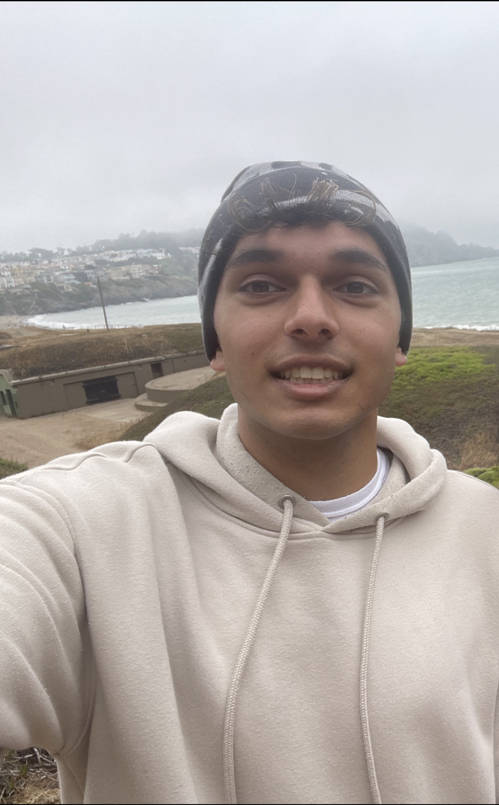

## About Me

hi i'm dhruv, a third year undergraduate student at uc berkeley. i am an undergraduate researcher in trevor darrell's group within berkeley artificial intelligence research lab (bair). my current work lies in inference aligned training for visual reasoning as well as post-training for web agents. previously i have been fortunate to work on recommendation systems at sephora and ml for visual neuroscience as part of the active vision and neural computation lab at berkeley.

outside of machine learning i enjoy weightlifting, writing, djing, and basketball.

## Research Interests

my interests tend to change over time but i am currently most excited about improving visual reasoning capabilities in vlms and developing causal approaches for interpreting language models

## Contact Information

you can reach me at dhruvpendharkar@berkeley.edu

---

> forsan et haec olim meminisse iuvabit
